# 🛠️ CardStrategy 開發指南

## 目錄

1. [項目概述](#項目概述)
2. [技術棧](#技術棧)
3. [環境設置](#環境設置)
4. [項目結構](#項目結構)
5. [開發流程](#開發流程)
6. [代碼規範](#代碼規範)
7. [測試指南](#測試指南)
8. [部署指南](#部署指南)
9. [故障排除](#故障排除)
10. [貢獻指南](#貢獻指南)

## 項目概述

CardStrategy 是一個基於 AI 的卡牌投資策略平台，提供卡牌管理、市場分析、投資建議和智能預測功能。

### 主要功能

- 🔐 用戶認證和授權
- 🃏 卡牌管理和收藏
- 📊 市場數據分析
- 💡 AI 驅動投資建議
- 🧠 深度學習價格預測
- 📈 投資組合管理
- 🔍 模擬鑑定系統
- 📱 實時通知系統

## 技術棧

### 後端技術

- **運行時**: Node.js 18+
- **框架**: Express.js 4.18+
- **數據庫**: PostgreSQL 15+
- **緩存**: Redis 7+
- **ORM**: Sequelize 6+
- **認證**: JWT
- **AI/ML**: TensorFlow.js
- **監控**: Prometheus + Grafana
- **容器化**: Docker + Docker Compose

### 前端技術

- **框架**: React Native 0.79.5
- **語言**: TypeScript 5.3.3
- **狀態管理**: Redux Toolkit
- **導航**: React Navigation 6
- **開發工具**: Expo SDK 53.0.20

### DevOps 工具

- **CI/CD**: GitHub Actions
- **容器編排**: Docker Compose
- **監控**: Prometheus, Grafana, ELK Stack
- **備份**: 自動化備份系統

## 環境設置

### 系統要求

- Node.js 18+
- PostgreSQL 15+
- Redis 7+
- Docker & Docker Compose
- Git

### 快速開始

1. **克隆項目**
```bash
git clone https://github.com/your-org/cardstrategy.git
cd cardstrategy
```

2. **安裝依賴**
```bash
# 後端依賴
cd backend
npm install

# 前端依賴
cd ../frontend
npm install
```

3. **環境配置**
```bash
# 複製環境變量文件
cp .env.example .env

# 編輯環境變量
nano .env
```

4. **啟動數據庫**
```bash
# 使用 Docker Compose
docker-compose up -d postgres redis
```

5. **運行遷移**
```bash
cd backend
npm run migrate
```

6. **啟動開發服務器**
```bash
# 後端
cd backend
npm run dev

# 前端
cd frontend
npm start
```

## 項目結構

```
cardstrategy/
├── backend/                 # 後端服務
│   ├── src/
│   │   ├── config/         # 配置文件
│   │   ├── controllers/    # 控制器
│   │   ├── middleware/     # 中間件
│   │   ├── models/         # 數據模型
│   │   ├── routes/         # 路由
│   │   ├── services/       # 業務邏輯
│   │   └── utils/          # 工具函數
│   ├── tests/              # 測試文件
│   ├── Dockerfile          # Docker 配置
│   └── package.json
├── frontend/               # 前端應用
│   ├── src/
│   │   ├── components/     # React 組件
│   │   ├── screens/        # 頁面組件
│   │   ├── services/       # API 服務
│   │   ├── store/          # Redux store
│   │   └── utils/          # 工具函數
│   ├── app.json           # Expo 配置
│   └── package.json
├── docs/                   # 文檔
├── scripts/                # 腳本文件
├── docker-compose.yml      # Docker 編排
└── README.md
```

## 開發流程

### 1. 功能開發流程

```mermaid
graph LR
    A[需求分析] --> B[設計文檔]
    B --> C[代碼實現]
    C --> D[單元測試]
    D --> E[集成測試]
    E --> F[代碼審查]
    F --> G[合併主分支]
    G --> H[部署測試]
    H --> I[生產部署]
```



### 2. Git 工作流

```bash
# 創建功能分支
git checkout -b feature/new-feature

# 開發和提交
git add .
git commit -m "feat: 添加新功能"

# 推送到遠程
git push origin feature/new-feature

# 創建 Pull Request
# 等待代碼審查和測試通過
```

### 3. 提交規範

使用 Conventional Commits 規範：

- `feat`: 新功能
- `fix`: 修復錯誤
- `docs`: 文檔更新
- `style`: 代碼格式調整
- `refactor`: 代碼重構
- `test`: 測試相關
- `chore`: 構建過程或輔助工具的變動

## 代碼規範

### JavaScript/TypeScript 規範

1. **使用 ESLint 和 Prettier**
```bash
npm run lint
npm run format
```

2. **命名規範**
```javascript
// 變量使用 camelCase
const userName = 'john';

// 常量使用 UPPER_SNAKE_CASE
const API_BASE_URL = 'https://api.example.com';

// 類名使用 PascalCase
class UserService {}

// 文件名使用 kebab-case
// user-service.js
```

3. **函數規範**
```javascript
/**
 * 獲取用戶信息
 * @param {number} userId - 用戶ID
 * @returns {Promise<User>} 用戶對象
 */
async function getUserById(userId) {
  // 實現邏輯
}
```

### 數據庫規範

1. **表名使用 snake_case**
```sql
CREATE TABLE user_profiles (
  id SERIAL PRIMARY KEY,
  user_id INTEGER REFERENCES users(id),
  created_at TIMESTAMP DEFAULT CURRENT_TIMESTAMP
);
```

2. **索引命名**
```sql
CREATE INDEX idx_users_email ON users(email);
CREATE INDEX idx_cards_user_id ON cards(user_id);
```

### API 設計規範

1. **RESTful 設計**
```
GET    /api/cards          # 獲取卡牌列表
GET    /api/cards/:id      # 獲取單個卡牌
POST   /api/cards          # 創建卡牌
PUT    /api/cards/:id      # 更新卡牌
DELETE /api/cards/:id      # 刪除卡牌
```

2. **響應格式**
```javascript
{
  "success": true,
  "message": "操作成功",
  "data": {
    // 數據內容
  },
  "pagination": {
    "page": 1,
    "limit": 10,
    "total": 100
  }
}
```

## 測試指南

### 測試類型

1. **單元測試**
```bash
# 運行單元測試
npm run test:unit

# 運行特定測試
npm run test:unit -- --grep "UserService"
```

2. **集成測試**
```bash
# 運行集成測試
npm run test:integration
```

3. **端到端測試**
```bash
# 運行 E2E 測試
npm run test:e2e
```

### 測試覆蓋率

```bash
# 生成覆蓋率報告
npm run test:coverage
```

目標覆蓋率：
- 單元測試: 80%+
- 集成測試: 70%+
- 總體覆蓋率: 75%+

### 測試最佳實踐

1. **測試文件命名**
```
user-service.test.js
auth-controller.test.js
card-routes.test.js
```

2. **測試結構**
```javascript
describe('UserService', () => {
  beforeEach(() => {
    // 設置測試環境
  });

  afterEach(() => {
    // 清理測試環境
  });

  describe('getUserById', () => {
    it('應該返回用戶信息', async () => {
      // 測試實現
    });

    it('應該處理用戶不存在的情況', async () => {
      // 測試實現
    });
  });
});
```

## 部署指南

### 開發環境部署

```bash
# 使用 Docker Compose
docker-compose up -d

# 或手動啟動
npm run dev
```

### 生產環境部署

```bash
# 使用部署腳本
./scripts/deploy.sh

# 或手動部署
npm run build
npm start
```

### 環境變量配置

```bash
# 開發環境
NODE_ENV=development
DB_HOST=localhost
DB_PORT=5432
DB_NAME=cardstrategy_dev
JWT_SECRET=your-dev-secret

# 生產環境
NODE_ENV=production
DB_HOST=production-db-host
DB_PORT=5432
DB_NAME=cardstrategy_prod
JWT_SECRET=your-production-secret
```

## 故障排除

### 常見問題

1. **數據庫連接失敗**
```bash
# 檢查數據庫狀態
docker-compose ps postgres

# 檢查連接配置
echo $DB_HOST
echo $DB_PORT
```

2. **Redis 連接失敗**
```bash
# 檢查 Redis 狀態
docker-compose ps redis

# 測試連接
redis-cli ping
```

3. **端口衝突**
```bash
# 檢查端口使用
lsof -i :3000
lsof -i :5432
lsof -i :6379
```

4. **依賴安裝失敗**
```bash
# 清理緩存
npm cache clean --force

# 重新安裝
rm -rf node_modules package-lock.json
npm install
```

### 日誌查看

```bash
# 查看應用日誌
docker-compose logs -f backend

# 查看數據庫日誌
docker-compose logs -f postgres

# 查看 Redis 日誌
docker-compose logs -f redis
```

### 性能調優

1. **數據庫優化**
```sql
-- 創建索引
CREATE INDEX idx_cards_name ON cards(name);

-- 分析查詢性能
EXPLAIN ANALYZE SELECT * FROM cards WHERE name LIKE '%Charizard%';
```

2. **緩存優化**
```javascript
// 使用 Redis 緩存
const cachedData = await redis.get('cache_key');
if (cachedData) {
  return JSON.parse(cachedData);
}
```

3. **內存優化**
```javascript
// 監控內存使用
const memUsage = process.memoryUsage();
console.log('Memory usage:', memUsage);
```

## 貢獻指南

### 貢獻流程

1. Fork 項目
2. 創建功能分支
3. 提交更改
4. 創建 Pull Request
5. 等待審查和合併

### 代碼審查標準

- 代碼符合項目規範
- 測試覆蓋率達標
- 文檔更新完整
- 性能影響評估
- 安全風險評估

### 問題報告

使用 GitHub Issues 報告問題：

1. 使用清晰的標題
2. 提供詳細的描述
3. 包含重現步驟
4. 附加錯誤日誌
5. 標註相關標籤

### 功能請求

1. 描述功能需求
2. 說明使用場景
3. 提供實現建議
4. 評估開發工作量

## 聯繫方式

- **項目維護者**: CardStrategy Team
- **郵箱**: support@cardstrategy.com
- **文檔**: https://docs.cardstrategy.com
- **問題反饋**: https://github.com/your-org/cardstrategy/issues

---

**注意**: 本文檔會持續更新，請定期查看最新版本。
