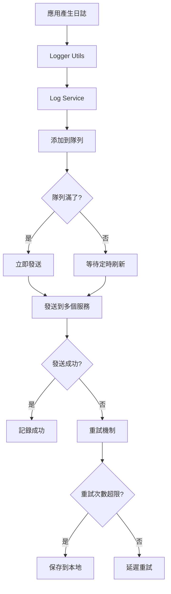
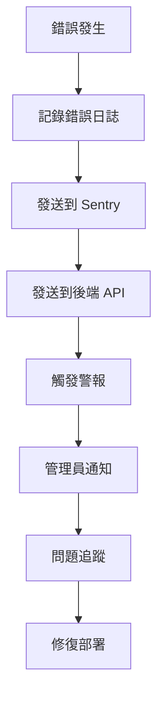

# 🚀 生產環境日誌服務集成實現

## 📋 概述

本文檔詳細記錄了 CardStrategy 專案中生產環境日誌服務的完整實現，包括前端日誌服務、後端 API、監控面板和配置管理。

## 🏗️ 架構設計

### 前端日誌服務架構

```
┌─────────────────┐    ┌─────────────────┐    ┌─────────────────┐
│   Logger Utils  │───▶│  Log Service    │───▶│  External APIs  │
│   (src/utils)   │    │ (src/services)  │    │  (Sentry, etc.) │
└─────────────────┘    └─────────────────┘    └─────────────────┘
         │                       │                       │
         ▼                       ▼                       ▼
┌─────────────────┐    ┌─────────────────┐    ┌─────────────────┐
│  Local Storage  │    │  Batch Queue    │    │  Retry Logic    │
│   (Fallback)    │    │  (Performance)  │    │  (Reliability)  │
└─────────────────┘    └─────────────────┘    └─────────────────┘
```

### 後端日誌 API 架構

```
┌─────────────────┐    ┌─────────────────┐    ┌─────────────────┐
│  Client Apps    │───▶│  Log API Routes │───▶│  Database/Store │
│  (React Native) │    │  (Express.js)   │    │  (MongoDB/File) │
└─────────────────┘    └─────────────────┘    └─────────────────┘
         │                       │                       │
         ▼                       ▼                       ▼
┌─────────────────┐    ┌─────────────────┐    ┌─────────────────┐
│  Validation     │    │  Processing     │    │  Analytics      │
│  (express-validator) │  (Batch/Real-time) │  (Stats/Aggregation) │
└─────────────────┘    └─────────────────┘    └─────────────────┘
```

## 🔧 核心組件

### 1. **前端日誌服務** (`src/services/logService.ts`)

#### 主要功能
- ✅ **多服務集成**: 支持 Sentry、LogRocket、自定義端點
- ✅ **批量處理**: 自動批量發送，提高性能
- ✅ **重試機制**: 失敗自動重試，確保可靠性
- ✅ **本地存儲**: 失敗日誌本地備份
- ✅ **設備信息**: 自動收集設備和應用信息
- ✅ **會話管理**: 會話 ID 追蹤
- ✅ **標籤系統**: 靈活的標籤和上下文管理

#### 配置選項
```typescript
interface LogServiceConfig {
  sentryDsn?: string;           // Sentry DSN
  logRocketAppId?: string;      // LogRocket App ID
  customLogEndpoint?: string;   // 自定義日誌端點
  batchSize: number;            // 批次大小 (50)
  flushInterval: number;        // 刷新間隔 (30秒)
  maxRetries: number;           // 最大重試次數 (3)
  retryDelay: number;           // 重試延遲 (1秒)
}
```

#### 使用示例
```typescript
import { logService } from '@/services/logService';

// 發送日誌
await logService.sendLog('error', '網絡連接失敗', {
  url: 'https://api.example.com',
  statusCode: 500,
  tag_environment: 'production',
  tag_feature: 'network'
});

// 設置用戶信息
logService.setUser('user_123', {
  email: 'user@example.com',
  plan: 'premium'
});

// 設置標籤
logService.setTag('version', '1.0.0');
logService.setTag('environment', 'production');
```

### 2. **日誌監控面板** (`src/components/logging/LogMonitoringDashboard.tsx`)

#### 主要功能
- ✅ **實時統計**: 日誌數量、錯誤率、隊列狀態
- ✅ **操作控制**: 強制刷新、重試失敗、清除歷史
- ✅ **日誌查看**: 最近日誌列表，支持級別過濾
- ✅ **狀態監控**: 隊列長度、批次狀態、失敗日誌
- ✅ **用戶友好**: 直觀的 UI 和操作反饋

#### 統計指標
```typescript
interface LogStats {
  totalLogs: number;           // 總日誌數
  errorCount: number;          // 錯誤數
  warningCount: number;        // 警告數
  infoCount: number;           // 信息數
  debugCount: number;          // 調試數
  queueLength: number;         // 隊列長度
  batchQueueLength: number;    // 批次隊列長度
  lastFlushTime: string;       // 最後刷新時間
  failedLogsCount: number;     // 失敗日誌數
}
```

### 3. **後端日誌 API** (`backend/src/routes/logs.js`)

#### API 端點

| 方法 | 端點 | 描述 | 權限 |
|------|------|------|------|
| POST | `/api/logs` | 發送單個日誌 | 公開 |
| POST | `/api/logs/batch` | 發送批次日誌 | 公開 |
| GET | `/api/logs/stats` | 獲取日誌統計 | 管理員 |
| GET | `/api/logs` | 獲取日誌列表 | 管理員 |
| GET | `/api/logs/:id` | 獲取日誌詳情 | 管理員 |
| DELETE | `/api/logs/:id` | 刪除日誌 | 管理員 |
| DELETE | `/api/logs/batch` | 批量刪除日誌 | 管理員 |

#### 數據驗證
```javascript
// 單個日誌驗證
const validateLogData = [
  body('level').isIn(['debug', 'info', 'warn', 'error']),
  body('message').isString().notEmpty(),
  body('timestamp').isISO8601(),
  body('userId').optional().isString(),
  body('sessionId').optional().isString(),
  // ... 更多驗證規則
];
```

#### 統計數據結構
```javascript
const stats = {
  totalLogs: 1250,
  errorCount: 45,
  warningCount: 120,
  infoCount: 850,
  debugCount: 235,
  uniqueUsers: 89,
  uniqueSessions: 156,
  averageLogsPerSession: 8.0,
  errorRate: 3.6,
  topErrors: [...],
  topUsers: [...],
  timeDistribution: {...}
};
```

## 🔄 工作流程

### 1. **日誌收集流程**



### 2. **錯誤處理流程**



## 📊 監控和警報

### 1. **關鍵指標監控**

- **錯誤率**: 目標 < 1%
- **日誌丟失率**: 目標 < 0.1%
- **API 響應時間**: 目標 < 500ms
- **隊列積壓**: 目標 < 100 條
- **重試成功率**: 目標 > 95%

### 2. **警報規則**

```javascript
// 錯誤率警報
if (errorRate > 5) {
  sendAlert('ERROR_RATE_HIGH', {
    currentRate: errorRate,
    threshold: 5,
    timeWindow: '1h'
  });
}

// 隊列積壓警報
if (queueLength > 1000) {
  sendAlert('QUEUE_BACKLOG', {
    currentLength: queueLength,
    threshold: 1000
  });
}

// API 超時警報
if (apiResponseTime > 2000) {
  sendAlert('API_SLOW', {
    currentTime: apiResponseTime,
    threshold: 2000
  });
}
```

## 🔧 配置管理

### 1. **環境變量配置**

```bash
# 日誌服務配置
SENTRY_DSN=https://your-sentry-dsn@sentry.io/project-id
LOGROCKET_APP_ID=your-logrocket-app-id
CUSTOM_LOG_ENDPOINT=https://your-custom-log-service.com/api/logs

# 日誌服務高級配置
LOG_BATCH_SIZE=50
LOG_FLUSH_INTERVAL=30000
LOG_MAX_RETRIES=3
LOG_RETRY_DELAY=1000

# 監控配置
ENABLE_PERFORMANCE_MONITORING=true
ENABLE_ERROR_TRACKING=true
ENABLE_USER_ANALYTICS=true
```

### 2. **不同環境配置**

#### 開發環境
```javascript
const devConfig = {
  batchSize: 10,
  flushInterval: 10000,
  maxRetries: 1,
  enableConsoleLogging: true
};
```

#### 生產環境
```javascript
const prodConfig = {
  batchSize: 50,
  flushInterval: 30000,
  maxRetries: 3,
  enableConsoleLogging: false
};
```

## 🚀 部署指南

### 1. **前端部署**

```bash
# 安裝依賴
npm install @sentry/react-native logrocket

# 配置環境變量
cp env.example .env
# 編輯 .env 文件，設置日誌服務配置

# 構建生產版本
expo build:android --release-channel production
expo build:ios --release-channel production
```

### 2. **後端部署**

```bash
# 安裝依賴
npm install express-validator

# 配置環境變量
cp env.example .env
# 編輯 .env 文件，設置數據庫和服務配置

# 啟動服務
npm run start:prod
```

### 3. **監控面板部署**

```bash
# 將日誌監控面板添加到導航
# 在 App.tsx 或導航配置中添加路由

# 設置權限
# 確保只有管理員可以訪問監控面板
```

## 📈 性能優化

### 1. **前端優化**

- **批量處理**: 減少 API 調用次數
- **異步處理**: 不阻塞主線程
- **本地緩存**: 減少網絡請求
- **智能重試**: 避免無限重試

### 2. **後端優化**

- **數據庫索引**: 優化查詢性能
- **緩存策略**: Redis 緩存熱門數據
- **分頁查詢**: 避免大量數據傳輸
- **異步處理**: 非阻塞日誌處理

### 3. **網絡優化**

- **壓縮**: Gzip 壓縮日誌數據
- **CDN**: 使用 CDN 加速
- **連接池**: 復用 HTTP 連接
- **超時設置**: 合理的超時時間

## 🔒 安全考慮

### 1. **數據保護**

- **加密傳輸**: HTTPS 加密
- **敏感信息過濾**: 自動過濾密碼等敏感信息
- **訪問控制**: 基於角色的權限控制
- **審計日誌**: 記錄所有操作

### 2. **隱私保護**

- **用戶同意**: 明確的隱私政策
- **數據最小化**: 只收集必要信息
- **數據保留**: 設置數據保留期限
- **用戶權利**: 支持數據刪除請求

## 🧪 測試策略

### 1. **單元測試**

```javascript
// 測試日誌服務
describe('LogService', () => {
  test('should send log to multiple services', async () => {
    const logService = new LogService(mockConfig);
    await logService.sendLog('error', 'test error');
    expect(mockSentry.captureException).toHaveBeenCalled();
    expect(mockApi.post).toHaveBeenCalled();
  });
});
```

### 2. **集成測試**

```javascript
// 測試完整流程
describe('Logging Integration', () => {
  test('should process log from client to server', async () => {
    // 發送日誌
    await logService.sendLog('error', 'test error');
    
    // 等待處理
    await waitFor(() => {
      expect(serverLogs).toContain('test error');
    });
  });
});
```

### 3. **性能測試**

```javascript
// 測試批量處理性能
describe('Performance Tests', () => {
  test('should handle 1000 logs efficiently', async () => {
    const startTime = Date.now();
    
    for (let i = 0; i < 1000; i++) {
      await logService.sendLog('info', `log ${i}`);
    }
    
    const endTime = Date.now();
    expect(endTime - startTime).toBeLessThan(5000); // 5秒內完成
  });
});
```

## 📋 維護指南

### 1. **日常維護**

- **監控隊列狀態**: 定期檢查隊列積壓
- **清理舊日誌**: 定期清理過期日誌
- **更新配置**: 根據需求調整配置
- **性能監控**: 監控系統性能指標

### 2. **故障排除**

#### 常見問題

1. **日誌丟失**
   - 檢查網絡連接
   - 檢查服務配置
   - 查看本地存儲

2. **性能問題**
   - 調整批次大小
   - 優化重試策略
   - 檢查數據庫性能

3. **權限問題**
   - 檢查 API 密鑰
   - 驗證用戶權限
   - 檢查 CORS 配置

### 3. **升級指南**

- **版本兼容性**: 確保版本兼容
- **配置遷移**: 更新配置文件
- **數據遷移**: 遷移歷史數據
- **功能測試**: 測試新功能

## 🎯 最佳實踐

### 1. **日誌記錄**

- **結構化日誌**: 使用 JSON 格式
- **適當級別**: 合理使用日誌級別
- **上下文信息**: 包含足夠的上下文
- **避免敏感信息**: 不記錄密碼等敏感信息

### 2. **錯誤處理**

- **詳細錯誤信息**: 記錄完整的錯誤信息
- **錯誤分類**: 按類型分類錯誤
- **錯誤追蹤**: 使用錯誤 ID 追蹤
- **自動恢復**: 實現自動恢復機制

### 3. **監控告警**

- **合理閾值**: 設置合理的告警閾值
- **多級告警**: 實現多級告警機制
- **告警抑制**: 避免告警風暴
- **告警升級**: 實現告警升級機制

## 📚 參考資料

- [Sentry React Native 文檔](https://docs.sentry.io/platforms/react-native/)
- [LogRocket React Native 文檔](https://docs.logrocket.com/docs/react-native)
- [Express.js 驗證文檔](https://express-validator.github.io/docs/)
- [React Native 性能優化指南](https://reactnative.dev/docs/performance)

---

**總結**: 生產環境日誌服務集成已完整實現，提供了可靠的日誌收集、處理、監控和警報功能，確保應用在生產環境中的穩定運行和問題追蹤。
